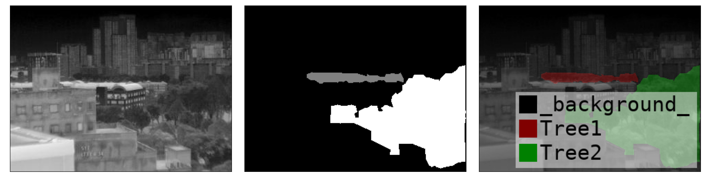
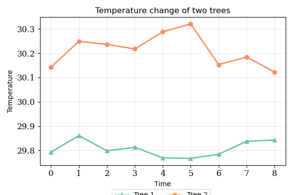

## Infrared Image Dataset (IRIS) Preprocessing

This is a collection of *infrared image dataset* **(IRIS)** preprocessing Python code. 

### Introduction

Infrared thermography provides a non-contact technique to analyze the built environment in various aspects. While most studies focus on a city and building scale, rooftop observatorys provide high resolution with dynamical interactions on a neighborhood scale. The first rooftop thermal observatory with a multi-modal platform capable of assessing a wide range of dynamical processes in urban systems was deployed in Singapore. The thermal observatory was placed on the top of a building that overlooks several educational buildings on the campus of the National University of Singapore. The platform collects remote sensing data from tropical areas on a temporal scale, allowing users to determine the temperature trend of individual features such as buildings, roads, and vegetation. To manage and analyze the obtained raw data and allow scientific users to utilize the data as they saw fit, demonstration code with data preprocessing such as segmentation was provided.

In this repository, we use several examples which can be downloaded from [zenodo](https://zenodo.org/records/7463996) (File path: S16_dataset_1.zip/2022-08-03.zip) to show the process of data preprocessing, including *file convert*, *data visualization* and basic *data analysis*. We hope this can provide a basic idea to those who want to explore more on this dataset. If you have further contributions to this repository, welcome to [contact](subin_lin@u.nus.edu) us.

### Environment

- Softwares: `Python`, [`Labelme`](https://github.com/wkentaro/labelme); 

- Python Packages: `numpy`, `pandas`, `flirextractor`, `matplotlib`, `PIL`;

### Structure

```
.
├── data/
│   ├── original/
│   │   ├── 2022-08-03
│   │   └── ...
│   ├── convert/
│   │   ├── snap-2022-08-03
│   │   └── ...
│   ├── processed/
│   │   ├── 2022-08-03
│   │   └── ...
│   └── README.md
├── notebook/
│   ├── 01_file_convert.ipynb
│   ├── 02_visualization.ipynb
│   └── 03_analysis.ipynb
├── src/
│   └── imageconvert.py
└── README.md
```

- `data`: all the original data and converted/processed data are here, for more details you may refer to the readme file under this folder `data/README.md`;
- `notebook`: three notebooks contain preprocess steps;
- `src`: runable preprocessing scripts are here;

### Quick Start

Before you start to do the preprocessing, pleaser refer to `data/README.md` to prepare the original data, including downloading the data and organizing the data in a proper structure. 

**Step 1**. Check the `notebook/01_file_convert.ipynb`, this notebook contain the process of converting the original data file (in `.jpg` format) to `.csv` files, for better analysis in the following steps. This process can also be done by the script `src/imageconvert.py`, but before running please double check the prepared original data files structure. 

**Step 2**. If you want to see the visualizaiton of the data, you can check the `notebook/02_visualization.ipynb`;

**Step 3**. Now you can use the [`Labelme`](https://github.com/wkentaro/labelme) to select the object in the figure to follow as a mask. It will looks like this:



For more details of `Labelme`, you may refer to the [official tutorial](https://github.com/wkentaro/labelme/tree/main/examples/tutorial#tutorial-single-image-example).  

**Step 4**. After you get the output from the Labelme, you can use the `notebook/03_analysis.ipynb` to analysis the value change of your selected domain. For more analysis details, you can refer to the notebook. 



After this you can do further custom experiments. 

### Contact

If you have any questions or find any bugs, feel free to raise an issue. If you have ideas to contribute to this repo, welcome to pull request or contact [subin_lin@u.nus.edu](subin_lin@u.nus.edu). Thanks for your interest in our work!
